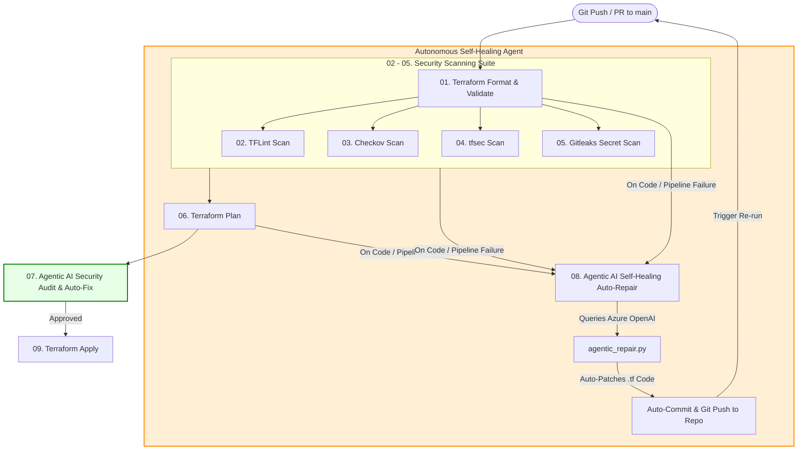
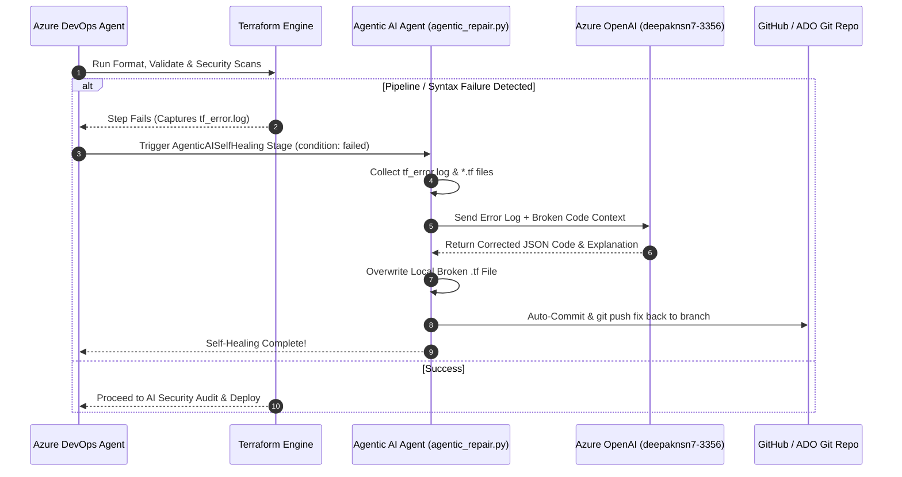

# 🤖 Agentic AI Self-Healing Infrastructure as Code (IaC) & Security Pipeline

[](https://dev.azure.com)
[](https://www.terraform.io)
[](https://ai.azure.com)
[](https://github.com/deepak-kr7/Agentic_ai_Self-repo)

An **Autonomous, Agentic AI-powered Self-Healing CI/CD Pipeline** for Azure DevOps. It provisions Azure Infrastructure using Terraform, executes 4 comprehensive security scans, audits deployment security using Azure OpenAI (`deepaknsn7-3356-resource`), and **automatically repairs broken code or security vulnerabilities in Git**.

---

## 🎯 Architecture Diagram



---

## 🔄 Self-Healing Sequence Diagram



---

## 📋 Implementation Plan Summary

### 1. Simple Nested Map Architecture (`var.resource_map`)
The infrastructure configuration uses a single, easy-to-read **nested map** in `terraform.tfvars`:

```hcl
resource_map = {
  "config1" = {
    rg_name  = "my-resource-group"
    location = "East US"

    storage = {
      name                     = "mystorageacct12345"
      account_tier             = "Standard"
      account_replication_type = "LRS"
    }

    vnet = {
      name          = "my-vnet"
      address_space = ["10.0.0.0/16"]
    }

    subnet = {
      name             = "my-subnet"
      address_prefixes = ["10.0.1.0/24"]
    }

    nic = {
      name = "my-nic"
    }
  }
}
```

### 2. Multi-Stage Azure DevOps Pipeline (`azure-pipelines.yml`)

- **Stage 01 (`TerraformValidate`)**: Formats HCL, initializes backend (`cicd_test`), and validates syntax.
- **Stage 02 (`TFLint`)**: Lints code against Azure HCL best practices.
- **Stage 03 (`Checkov`)**: Checks compliance against 1000+ IaC security policies.
- **Stage 04 (`tfsec`)**: Detects static security misconfigurations.
- **Stage 05 (`Gitleaks`)**: Prevents secrets, tokens, or credentials from leaking into Git.
- **Stage 06 (`TerraformPlan`)**: Generates and converts the binary plan to JSON.
- **Stage 07 (`AgenticAISecurityScan`)**: Sends security scan reports + plan JSON to Azure OpenAI (`deepaknsn7-3356-resource`) to generate a security assessment and auto-fix security flaws.
- **Stage 08 (`AgenticAISelfHealing`)**: **Runs automatically on pipeline failure (`condition: failed()`)** to fix syntax/deployment bugs.
- **Stage 09 (`TerraformApply`)**: Applies infrastructure changes to Azure.

---

## 🛠️ Repository File Structure

```text
├── azure-pipelines.yml     # Azure DevOps 9-Stage CI/CD Pipeline
├── agentic_repair.py       # Autonomous Agentic AI Self-Healing & Security Python Script
├── main.tf                 # Terraform resource definitions using for_each
├── variables.tf            # Type definition for nested resource_map
├── terraform.tfvars        # Infrastructure input data
├── providers.tf            # AzureRM Provider configuration
├── outputs.tf              # Created resource outputs
└── README.md               # Architecture documentation & diagrams
```

---

## ⚙️ Azure DevOps Setup Instructions

1. **Agent Pool**: Ensure your self-hosted agent pool **`2nd_pool`** is online.
2. **Service Connection**: Ensure Azure Resource Manager service connection **`2nd project service`** is configured.
3. **Azure OpenAI Endpoint**:
   - Resource: `deepaknsn7-3356-resource`
   - Endpoint: `https://deepaknsn7-3356-resource.openai.azure.com/`
   - Set `AZURE_OPENAI_API_KEY` in Azure DevOps Pipeline Variables / Variable Group (`terraform-ai-variables`).
4. **Git Push Permissions for AI Bot**:
   - Go to **Project Settings** ➔ **Repositories** ➔ Select Repository ➔ **Permissions**.
   - Set **Contribute** to **Allow** for `Project Collection Build Service` / `Build Service` user.

---

## 🧪 How to Test Self-Healing

1. Intentionally introduce a syntax error in `main.tf` (e.g. `resource "azurerm_resource_group" "rg" { for_each = `).
2. Commit and push to Git:
   ```bash
   git add main.tf
   git commit -m "test: intentional syntax error"
   git push origin main
   ```
3. Watch Azure DevOps pipeline fail at Stage 01, trigger **Stage 08 (`AgenticAISelfHealing`)**, call Azure OpenAI, auto-fix `main.tf`, and push the fix back to GitHub!
